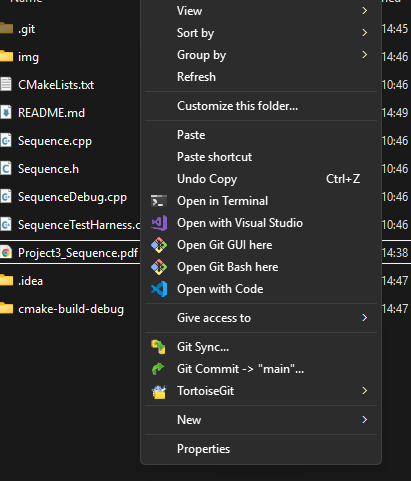
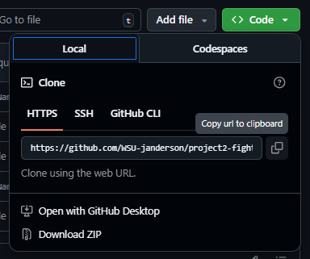
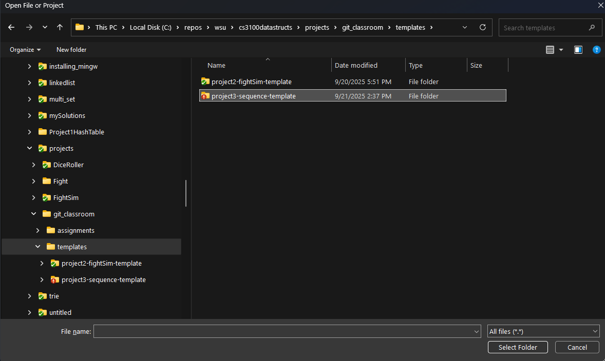
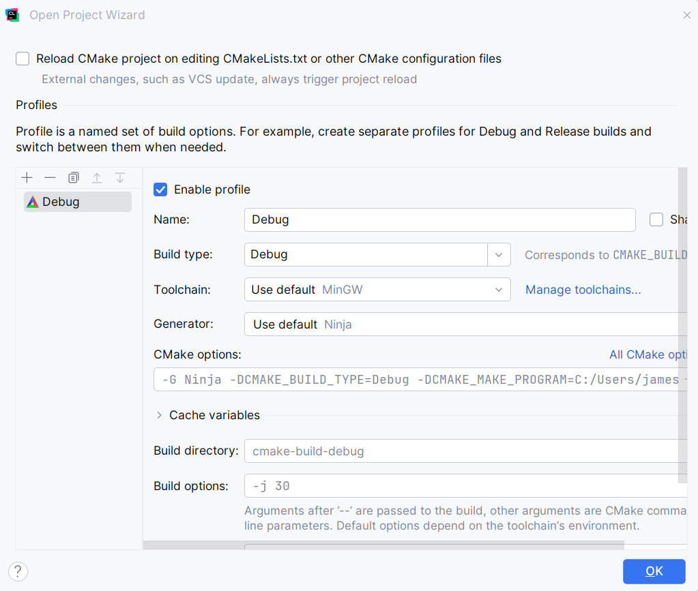
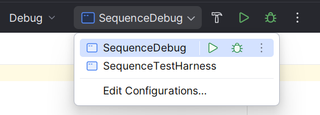
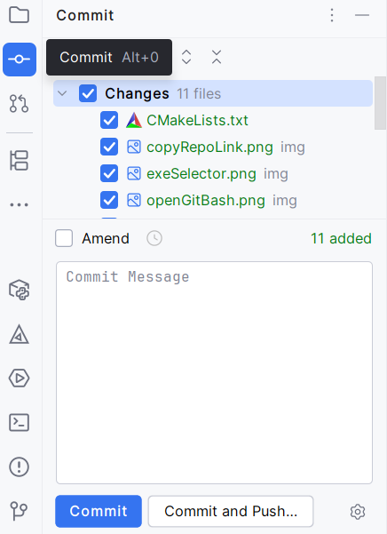
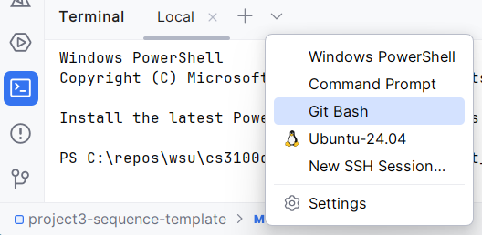

# Project 3 - Linked Sequence Data Structure
 This repo contains the starter code for Project 3 - Linked Sequence Data Structure for CS 3100 Data Structures and Algorithms. Follow this README.md for instructions on how to open the project in CLion.

## Clone Repo

After you accept the GitHub Classroom assignment, you need to clone the repository onto your computer. If you know how to clone a repository, you can skip this step. If on Windows, I recommend browsing in the File Explorer to the directory you wish to clone the repository into. If you right-click, you should see an option to `Open Git Bash here`.

That will open a terminal with the working directory the same as the one you were in. Go to your repoository in a web browser, and click the `<> Code` drop-down. 

You will see the URL for your repository, and if you click on the squares to the right of that, it will copy the link to your clipboard. Back in Git Bash, type `git clone `, then press `Shift-Insert` to paste. You can also right-click to paste. Press enter, and you may be asked to log in to GitHub. If successful, you now have the repository cloned.

## Project Setup

Once you clone the GitHub Classroom assignment repo onto your machine, you want to open that directory in CLion. You can either
select `Open` from the Welcome to CLion screen, or if you have a project open, navigate to `File | Open` from the main
menu to open the `Open File or Project` window.

Navigate to where the project is saved, and open the _directory_, not an individual file. You can select the directory,
then click `Select Folder`

CLion will open, and you should see a window titled `Open Project Wizard`. If there are no errors on this screen, click
OK. That window will look similar to this:

The next thing you should do is test you can build and run the project. In the upper-right of CLion, next to the dropdown
with `Debug`, you should see a drop down to the right that says `SequenceDebug`. If not, open the menu and select
`SequenceDebug`. Next, click the hammer icon to build the project. With the project sucessfuly built, you can now run (
or debug) the program with the triangle (or bug) icon. If you see `Your project is ready to go!` output, then your
project is ready to go!

### `SequenceDebug.cpp`

When `SequenceDebug` is selected from the dropdown menu, the project will use `SequenceDebug.cpp` for the main function.
This file is mostly empty with a main function. In this file, you will write small tests as you implement `Sequence`. I
recommend for each small test you do, once it works, commit what you have done.

### `SequenceTestHarness.cpp`
Once you have implemented and tested all of `Sequence`, you can now switch from `SequenceDebug` to `SequenceTestHarness`
from the dropdown menu. When you run this configuration, the main in `SequenceTestHarness.cpp` will be utilized.
`SequenceTestHarness.cpp` is the same test file I will use when grading projects. You don't need to necessarily look
through `SequenceTestHarness.cpp`, but you are more concerned with the output. The output will print the result of each
test, and whether it was a success or there was an error.

One caveat is the memory leak test cannot be done in code easily, so you will have to do that manually. We will discuss
in class how to check for memory leaks using the `Task Manager` if you are using Windows. If you're on MacOs, the
equivalent program is called `Activity Monitor` and on Ubuntu, `System Monitor`.

## Project Instructions

Once you can build and run the starter code, you can now actually start the project. You can find the project description in  [Sequence.pdf](Sequence.pdf).

## Commit and Push

You should regularly commit your work, and I recommend pushing often so your work is backed up. In CLion, you should at least be able to commit. For some reason, most students cannot push their commits directly from CLion. To commit, you will click on the Commit pane to the left of the project pane. Check the files you wish to commit, then type a message and click `Commit`.

To push, at the bottom left, click on the Terminal pane. From the drop-down, select `Git Bash` to open a new bash shell. Type `git push`, and your code should now appear on the remote branch.

