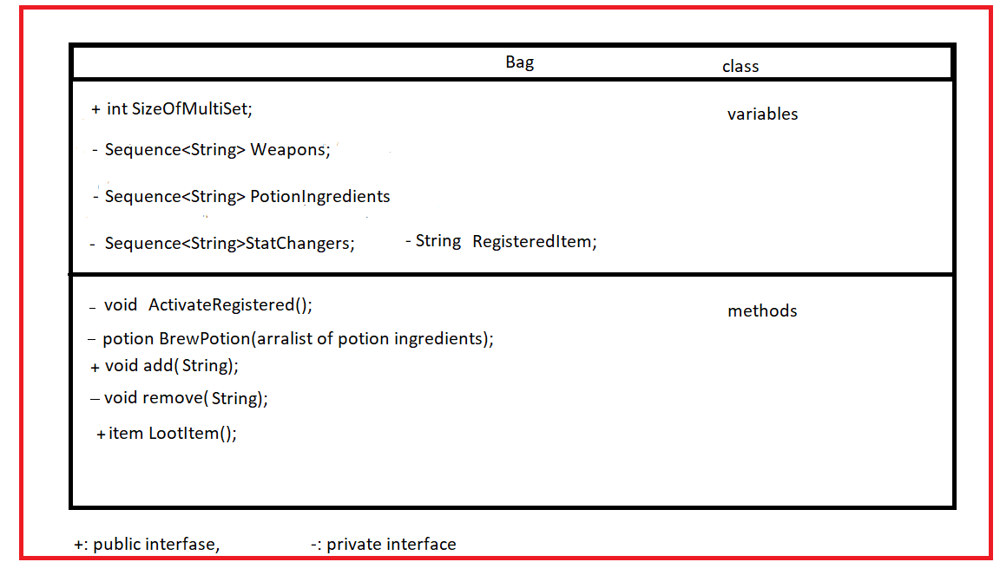
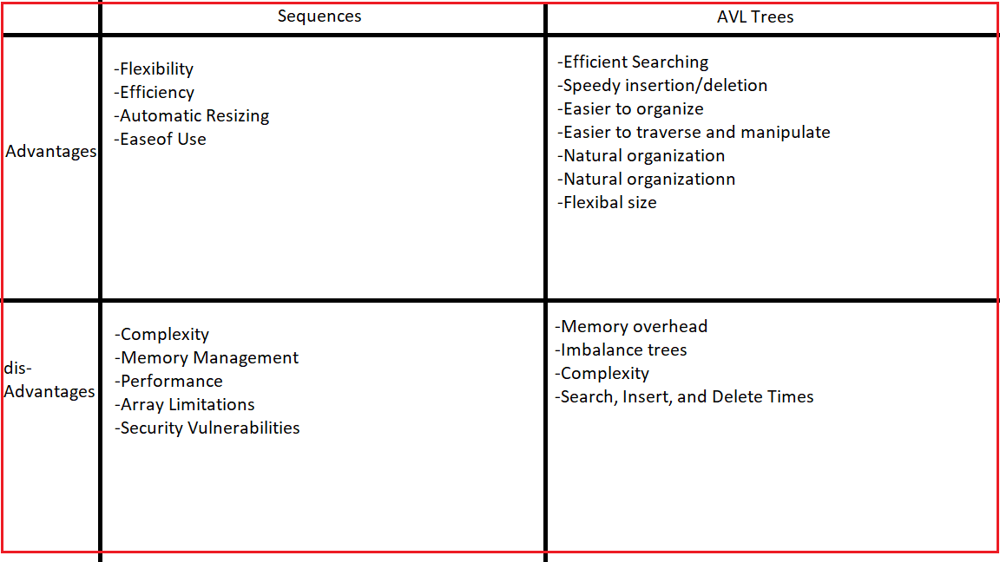
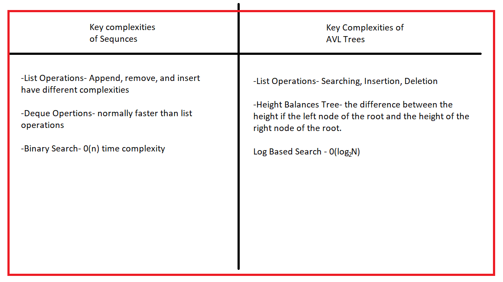

														Project 6
													Multiset Design

1.Introduction

In my gamming scenario I will be using a Virtual Reality game headset (as with the one use with Meta Quest) 
where the yser plays as a medieval warrior with multiple types of inventory items, including, but not limited to, 
a sword,  an ax,  mace, bow and arrow, coins, keys (many of which will have different shapes and colors),  
maps, and potions (each specifically will do different things depending on the potion itself), etc..  Each item will 
be sorted in separate types of sequences.  For example, the weapons such as the sword, ax, and bow and arrow will 
all be in a sequence called "Weapons", while the potions, or any magical items with the ability to be used to 
regenerate lost stamina, or increase stats such as "Hit" points, speed, or attack strength, will be in a sequence 
called "StatChangers". The scenario could also have sequence variables called "PotionIngredients" that holds ingredients 
so the avatar could use them to brew potions. The multiset's sole purpose is to store strings or titles of each item 
in the game.

2. Design Philosophy
   
In this reality game, the users would play with headsets like Meta quest, and they would be the use my multiset (or bag).
In the multiset (which I’m just going to declare it as a "bag" for this scenario) the system uses an integral counter 
that represents the number of objects in my bag called "SizeOfMultiList", which would be incremented or decremented
when the user either adds or subtracts objects from it. To make the multiset more readable and simpler to use, 
when the user wants to access the data in the "bag", the system uses a set of sequences that will be used to organize
the objects in them based on how many times they have been used.  If the user desires to remove it, the user selects 
it from the menu and presses the drop button.  The user then instructs the system how many of that object is to be
eliminated permanently.

3.Core Operations

A useful operation a multiset would support would be "bagRemove(x)" to remove an object in the bag based on the "x" parameter, 
or "bagAdd(x)", to add something to the bag, which is also based on the "x" parameter. Both of these operations use "0(n)".
Another operation any multiset would use is "bagShuffle()" to randomly reorganize each and every item in the bag. This would 
require a time complexity of "0(n)". The final operation that a multiset would use is to grab the first object that is on the 
list, such as "bagGrab()", which would have a time complexity of 0(1).

4.Set Operations

The first operation in this virtual reality game is to label a key item such as a weapon or an actual key 
from any item in my bag that is useful for the game quest. In that way, if the user presses a button on my 
controller, such as "select", the user can immediately use that object without later having to go to the bag
and look for the object, which could be time-consuming. The time complexity should be "0(n)". This would be done
by having the program check each individual item until it hits the object that is labeled as "REGISTERED".  The
second operation would be a search for each of my potion ingredients in the bag. The system could use a function that
calculates which potion ingredients that is most likely to be used at any given moment in the game. For example, for a
dragon boss battle, the sysemr may be more concerned about the character getting burned. Or if the user desires to battle
an enemy with high stats, the user would need a potion that would require stats to be increased. The system would likely
use recursion for this scenario which would likely result in a time complexity for this method to be "0(log n)". 

5. Extension Feature
   
The code for the first method would be"void activateRegistered()", which is used to activate the labeled item
in the multiset. The code for the second method would be "Potion BrewPotion(List of Ingredients)", that would 
return a potion object so all the ingredients in the parameter ( which will be sorted in a vector) will be 
turned into a potion. If more or defferent variables were added to the multiset, it would be the number of unique 
items in the multiset, such as items that are not duplications. This would be an integer variable called 
"numberOfUniqueItems".

6. UML Diagram / Abstraction Boundary
   
The UML of my multiset called "Bag"
			

   
   

The advantages of both Sequences and AVLTrees
			

   
   

Complexities of Sequences and AVLTrees
			

7. Trade-off Analysis
   
The data structure chosen is a sequence and the system will be comparing it to an AVL tree. This sstem is 
chosen mainly because it is simpler and has more flexibility for its data, as well as its ease of use, 
and accessing its data can be quite efficient, especially if it is a priority queue rather than just
a vector or an array list.  Though it does have some disadvantages, such as being more prone to wasted 
memory(3) and can also lead to memory leaks. Using an AVL tree does have advantages, such as efficient 
searching(2), making retrieving data faster and more efficient in most scenarios.  Additionally, there is
quicker insertion and deletion. However, the disadvantage of using a tree is that it requires a lot of
memory to use and if the tree is not balanced it can result in uneven search times. Another disadvantage is its 
complexity which can be difficult to understand for the person doing the coding. That is why I would prefer 
using a sequence for the game making it more simpler for the code writer because I normally value simplicity. 
If it became necessary to go back and degub the code, then fixing any errors would be much simpler than 
using Hashtables or AVLTrees.

8. Alternative Design Sketch
    
The use of other types of data structures, such as HashTable or AVLTrees, organizing each item that 
comes out of the bag might be a bit different than using a sequence. If using a HashTable, each item 
might be organized in a more unexpected way, Hashtables organize their elements based on a numeric 
system such as integers, but the game programmer might not be able to understand how each object 
will be organized and will be  randomly sorted which might cause frustration to the player.  Using sequences 
is a bit more predictable and less stressful since all you have to do is look at each element in the bag 
one by one until you find the correct item.  Using AVLTrees would likely be better than using HashTables 
but not better than sequences. Using AVLTrees might organize the items with less predictability especially 
if the system would constantly balance each item in the tree not knowing exactly how they are organized. Also, 
it should be noted that coding an AVL tree is more complicated than coding a sequence., as balancing the tree 
after ever insertion or removal is time-consuming. 	

9. Evaluation Plan
    
In testing the data structures of this virtual world game, I would recommend hiring a beta tester that 
would test each part of the game.  When testing certain sections of the game, such as brewing a potion 
or fighting a medieval dragon, the tester would need to have access to your items in the bag that are 
organized using the sequence. If the tester feels that using a sequence is not the best approach to 
organizing the elements of the bag then I would not hesitate changing up and using any one of the other
data structures.  However, if the game tester is truly satisfied with the results then I feel that the 
extensibility and maintainability of the bag is well organized and implemented.

10. Conclusion / Reflection
    
The bag would be a strong and effective multiset due to the abstraction(4) of it. In the UML chart 
of the bag, you would see that the only method that is public is the "LootItem" method because I want the 
bad guys in the game to snatch an item from a character, and in order to do this, they need access to 
a method in the player's bag class which needs to be a public interphase for it to be usable.  However, 
the other methods and variables are all private because I only want the player to have access to them 
and no other class, including other players in the game, should be allowed to manipulate the data 
in the game.

Documentation
Written by: 
	Tyler
	Raymond
	Harvey

1. https://www.bing.com/search?q=c%2B%2B+advantages+of+using+sequences&form=ANNTH1&refig=6925f596ec854fd496fa2dd4de84c1ef&pc=LCTS
2. https://www.geeksforgeeks.org/dsa/applications-advantages-and-disadvantages-of-tree/
3. https://www.bing.com/search?q=c%2B%2B%20disadvantages%20of%20using%20sequences&qs=n&form=QBRE&sp=-1&lq=0&pq=c%2B%2B%20disadvantages%20of%20using%20sequences&sc=8-36&sk=&cvid=8818C15EE6B049148E26EA0D1D8426A0
4. https://en.wikipedia.org/wiki/Abstraction_(computer_science)
	
