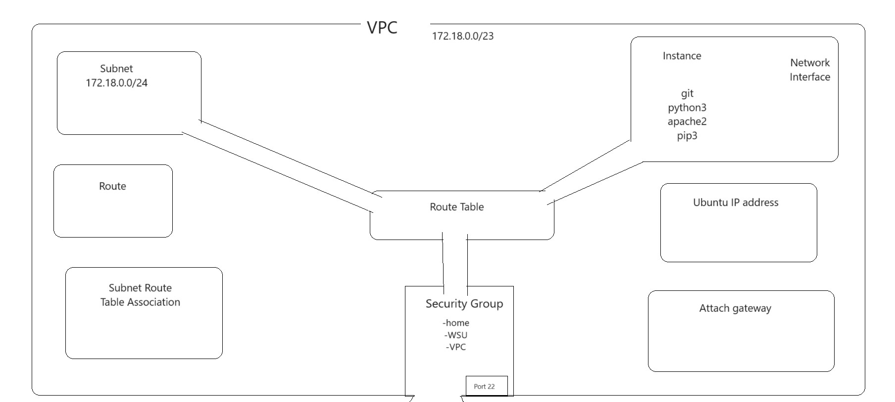

1. My cloudformation includes many kinds of resources such as a VPC with a subnet ip range of 172.18.0.0/23. The name of my VPC is "Harvey-CF-VPC".

    My VPC contains many resources inside of it such as a route that will only work if a route table is installed onto my VPC. The purpose of the route is for you to create all of your AWS resources. This gives you the ability to dynamically route all incoming data to any other AWS services based on the content of the incoming request.

    the properties of my route include:
    
        -RouteTableId: !Ref RouteTable
        -DestinationCidrBlock: 0.0.0.0/0
        -GatewayId: !Ref InternetGateway

2. My VPC also contains a Subnet Route Table Association which is supposed to associate a subnet along with a route table.

    The properties of my Subnet Route Table Association includes:

        -SubnetId: !REF Subnet
        -RouteTableId: !Ref RouteTable

3. My VPC also contains a Ubuntu Ip address resource which holds the private Ip address for the instance I made which I will explain later.

    The properties of my Ubuntu Ip address incclude:

        -Domain vpc
        -InstanceId: !Ref PublicUbuntuInstance

4. My VPC also contains an Attach Gateway resource which has a funtion to allow connectivity to flow between the internet and your VPC

    The properties of my Attach Gateway include:

        -VpcId: !Ref VPC
        -InternetGatewayId: !Ref InternetGateway

5. My VPC also contains an internet gateway resource which has mainly the same function as an Attach Gateway, to allow connectivity to flow between the internet and your VPC

    The properties of my internet gateway include:

        -Tags:
            -Key: Application
            Value: !Ref 'AWS::StackId'

6. My VPC also contains a security groups resource which contains all of ingress rules that allow what kind of data can be allowed to go through my VPC, in this case I instruchted my security group to accept data that comes from my own personal computer. I also instructed it to accept data from any client computer in Wright State University. And finaly I accpted data from my VPC itself. All of these rules us an IP protocol of tcp and a FromPort and ToPort of 22.

    The properties of my SecurityGroup are as follows:

        -IpProtocol:tcp
        FromPort: '22'
        ToPort: '22'
        CidrIp: 208.38.225.214/32
        -IpProtocol:tcp
        FromPort: '22'
        ToPort: '22'
        CidrIp: 130.108.0.0/16
        -IpProtocol:tcp
        FromPort: '22'
        ToPort: '22'
        CidrIp: 172.18.0.0/23

7. My VPC also contains a route table resource that contains a set of rules, called routes, with the purpose of determining where exactly the network traffic from either your subnet or your gateway is directed to.

    The properties of my route table are as follows:

        -VpcId: !Ref VPC
        Tags:
            -Key: Application
            Value: !Ref 'AWS::StackId'

8. My VPC also contains the Subnet resource. SUbnets are logical subdivision in a VPC. The subnet Ip range i gave to this susbnet is 172.18.0.0/24 which give a range of 256 different IP addresses.

    The properties of my subnet are as follows:
        -VpcId: !Ref VPC
        CidrBlock: 172.18.0.0/24
        Tags:
            - Key: Application
            Value: !Ref 'AWS::StackId'
            - Key: Name
            Value: Harvey-CF-VPC

9. My VPC has one final resource and probably the most important of all, the instance. An instance happens to be a virtual machine that is capable of running on the AWS cloud, much like your own little computer online that has its own operating system with other resources as well.

    My instance has many properties one of which happens to be a network interface, which is used to enable a network connection for my instnace.
    within my Network Interface I was able to assign a private Ip address to my instance of 172.18.0.100.

    My instance also has a property of User data which i used to tell my instance what software I want to install when my YAML file is run on a stack. I programmed it to install git, python3, apache2, as well as pip3. I also programmed it to change the host name of my instance to "Harvey-CF-instance" instead of the default IP address.

9. Here is a image of my VPC i created in my own image:
    

Written by:

Tyler
R.
Harvey

