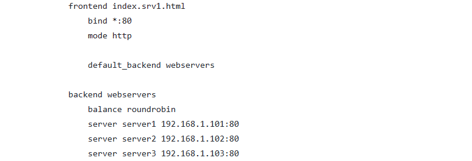
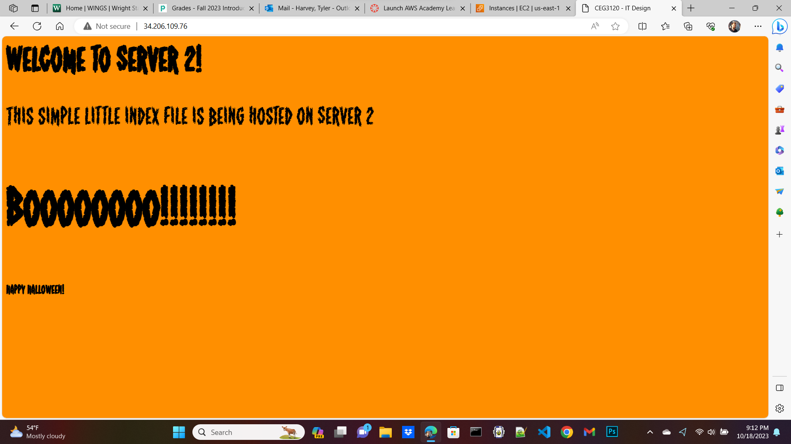
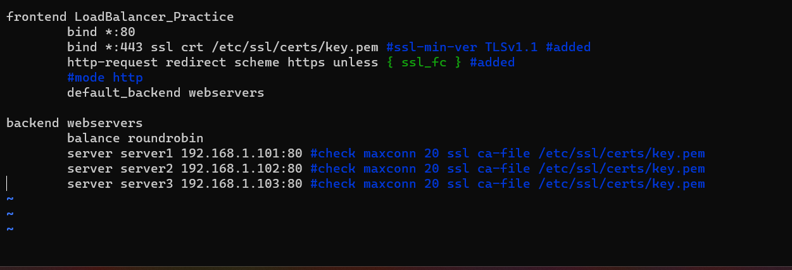
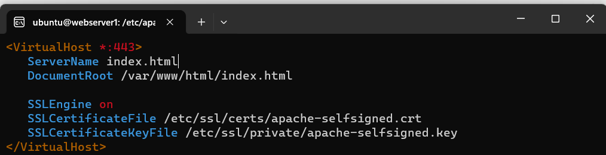

1. The goal of the project is to create 3 host instances and a proxy instance that is supposed to be a hub for the client, when the client tries to access the proxy instance they will emediatly be redirected to 1 of the other host instances in sequence, the client will then see whatever html code that is on that host instance.

2. a) sudo vim /etc/hosts
   
   b) The host file is mainly a text file that is used by Windows to help directed IP addresses to host names/ domain names. In other words this file acts like a DNS service for your PC. It overrides the mappings from the DNS server that your personal computer is currently connected to.
   
   c) if you are trying to ssh into the proxy instance then type down "ssh -i privatekey.pem ubuntu@public IP address". If you are trying to ssh into the hosts instances, then you need to first ssh into the proxy server and make a copy of your private key into each of the hosts server then you can ssh into them from your proxy instance with the following code:
   
                            ssh -i privatekey.pem ubuntu@private IP address
   
4. when I went on my wsl I ssh'd into my proxy server, then I typed down sudo vim /etc/haproxy/haproxy.cfg
   
    a) I had made the neccessary modification in the file path of /etc/haproxy/haproxy.cfg.
   
    b)following the configurations:
         
            
    c) "sudo systemctl restart haproxy.service" is the command to restart the haproxy.
   
    d) https://www.haproxy.com/blog/the-four-essential-sections-of-an-haproxy-configuration // this shows how I can go into and edit my haproxy.cfg file.

6. 
    a) the files on each host instance are the index.html file.
   
    b)the configurations I made were just to display the proper web page for each host instance, such as the 1st host instance will display "this is server 1", server 2 will display "this is server 2", and the third server will display "this is server 3".
   
    c)/var/www/html/index.html on each host instance
   
    d)"sudo systemctl restart apache2.service" is the command to restart apache2
   
    e)[https://stackoverflow.com/questions/56151917/how-to-fix-apache2-debian-default-page-instead-of-my-site#:~:text=Hit%20in%20the%20browser%20bar%20the%20url%20that,possible%20to%20change%20the%20root%20page%20to%20yours.](https://www.youtube.com/watch?v=k87iYjZaezU) // this shows where the the index.html file is so I can change it

8. 
    This is the image for the first server(with my own personal css style):
        

    This is the second Server image:
        

    This is the third:
        

Extra credit part:

   1. HTTPs is basically the same as HTTP except it is far more secure. HTTPS uses TLS/SSL to encryp normal HTTP code and make it safer for traveling over the internet so even if a hacker hacks into the datastream and downloads the data it is perfectly encryped and without the private key to decryped the data, it will be useless to them.

   2. image to show the new haproxy.cfg :
      

   3. this is the code I made to make apache2 handle https:
      

   4. I just altered the security groups to accept any ip address range if the port is 443, or if its an https protocal.

   5.
